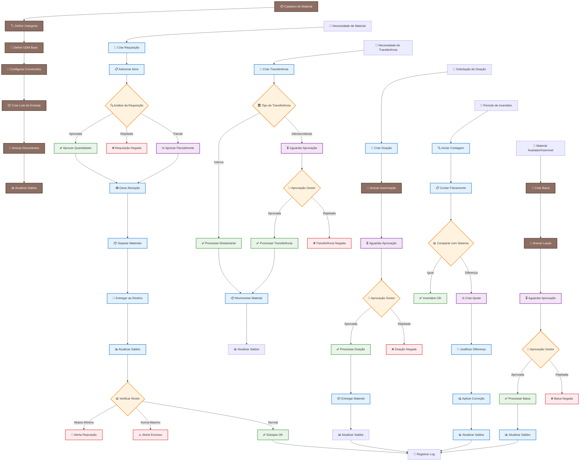

# Sistema de Controle de Estoque e Inventário - Defesa Civil do Amazonas
## Especificação Técnica Unificada

---

## 📋 Informações do Projeto

**Órgão:** Defesa Civil do Amazonas (DCAM)  
**Sistema:** SISPDEC - Módulo de Inventário  
**Versão:** 2.0  
**Data:** Janeiro 2025  
**Responsável:** Departamento de Desenvolvimento de Sistemas  

**Contatos:**
- 🌐 Website: www.defesacivil.am.gov.br
- 📱 Instagram: @defesacivil.amazonas
- 🐦 Twitter: @defesacivilam
- 📍 Endereço: Rua Urucará, 183, Cachoeirinha - Manaus/AM - CEP: 69065-180

---

## 🎯 Visão Geral do Sistema

### **Objetivo Principal**
Criação de um módulo de Inventário completo para cadastrar e gerir todos os materiais adquiridos pela Defesa Civil do Amazonas, contemplando entrada em estoque, alocação/entrega para departamentos internos ou municípios, transferências, doações, com suporte a anexos, integração SIGED, controle por unidades de medida e rastreabilidade completa.

### **Características do Sistema**
- **Estoque central único** para armazenar materiais da Defesa Civil
- **Múltiplas unidades de medida** com conversões automáticas
- **Rastreabilidade completa** de todas as movimentações
- **Integração com SIGED** via links e APIs
- **Sistema de aprovações** para operações críticas
- **Auditoria e logs** detalhados
- **Suporte a anexos** (fotos, PDFs, documentos)

### **Escopo Inicial**
- ✅ Cadastro de Material (entrada em estoque)
- ✅ Movimentações: Entrega/Alocação, Transferência, Doação, Ajuste, Baixa
- ✅ Consulta/Relatórios avançados
- ✅ Perfis e permissões granulares
- ✅ Sistema de aprovações
- ✅ Integração com SIGED

---

## 👥 Personas e Perfis de Usuário

### **Personas Principais**

| Persona | Responsabilidades | Acesso |
|---------|------------------|--------|
| **Almoxarife/Estoquista** | Cadastra materiais, gerencia estoque, realiza movimentações | Operacional completo |
| **Gestor** | Aprova operações críticas, consulta relatórios consolidados | Aprovações e relatórios |
| **Chefe de Departamento** | Solicita e recebe materiais, consulta itens alocados | Requisições e consultas |
| **Agente Municipal** | Recebe materiais destinados ao município, anexa termos | Recebimento e documentação |
| **Auditoria/Controladoria** | Acesso somente leitura aos registros e documentação | Somente consulta |

### **Perfis de Permissão**

| Perfil | Permissões | Descrição |
|--------|------------|-----------|
| `INVENTARIO_ADMIN` | **Total** | Acesso completo ao sistema |
| `INVENTARIO_GESTOR` | **Aprovações** | Aprova doações, conclui transferências |
| `INVENTARIO_OPERADOR` | **Operacional** | Cadastra e movimenta (exceto doação e baixa com valor) |
| `INVENTARIO_CONSULTA` | **Leitura** | Consultas e relatórios |

---

## 🗂️ Modelo de Dados Unificado

### **1. 📦 MATERIAL**
**Descrição:** Cadastro principal de todos os itens que podem ser estocados.

| Campo | Tipo | Descrição | Regras |
|-------|------|-----------|--------|
| `id` | UUID | Identificador único | PK |
| `nome` | VARCHAR(200) | Nome do material | Obrigatório |
| `id_compra` | VARCHAR(100) | ID da compra | Obrigatório, indexado |
| `link_siged` | URL | Link para processo no SIGED | Opcional, validado |
| `descricao` | TEXT | Descrição detalhada | Obrigatório |
| `udm_base_id` | UUID | Unidade de medida base | FK(UDM) |
| `valor_unitario_compra` | DECIMAL(14,2) | Valor unitário de compra | ≥ 0 |
| `possui_tombo` | BOOLEAN | Se possui tombamento | Default false |
| `numero_tombo` | VARCHAR(50) | Número do tombo | Único se informado |
| `tags` | TEXT[] | Tags para busca | Opcional |
| `min_stock` | DECIMAL(18,6) | Estoque mínimo | Alerta de reposição |
| `max_stock` | DECIMAL(18,6) | Estoque máximo | Alerta de excesso |
| `is_active` | BOOLEAN | Material ativo | Default true |
| `criado_por` | UUID | Usuário criador | FK(Usuario) |
| `criado_em` | TIMESTAMP | Data de criação | Auto |

**Exemplos de materiais:**
- Canos e conexões hidráulicas
- Material elétrico (cabos, disjuntores)
- Equipamentos (lanchas, purificadores)
- EPIs (capacetes, coletes, luvas)
- Kits de emergência

---

### **2. 🏷️ MATERIAL_CATEGORY**
**Descrição:** Organização hierárquica dos materiais por tipo.

| Campo | Tipo | Descrição | Regras |
|-------|------|-----------|--------|
| `id` | UUID | Identificador único | PK |
| `name` | VARCHAR(100) | Nome da categoria | Obrigatório |
| `parent_id` | UUID | Categoria pai | FK(Material_Category) |
| `description` | TEXT | Descrição da categoria | Opcional |
| `is_active` | BOOLEAN | Categoria ativa | Default true |

**Estrutura hierárquica:**
```
📁 Elétrico
  └── Cabos
  └── Disjuntores
  └── Lâmpadas
📁 Hidráulico
  └── Canos
  └── Conexões
  └── Bombas
📁 EPIs
  └── Proteção Individual
  └── Equipamentos de Segurança
📁 Equipamentos
  └── Embarcações
  └── Purificadores
  └── Geradores
📁 Emergência
  └── Kits de Primeiros Socorros
  └── Equipamentos de Resgate
```

---

### **3. 📏 UDM (Unidade de Medida)**
**Descrição:** Unidades de medida para contabilizar os materiais.

| Campo | Tipo | Descrição | Regras |
|-------|------|-----------|--------|
| `id` | UUID | Identificador único | PK |
| `codigo` | VARCHAR(20) | Código da unidade | Único |
| `nome` | VARCHAR(50) | Nome completo | Obrigatório |
| `simbolo` | VARCHAR(10) | Símbolo da unidade | Obrigatório |
| `tipo` | ENUM | Tipo da unidade | PESO, VOLUME, COMPRIMENTO, UNIDADE |

**Exemplos:**
- UN (Unidade) - para itens individuais
- CX (Caixa) - para materiais embalados
- KG (Quilograma) - para materiais pesados
- L (Litro) - para líquidos
- M (Metro) - para cabos, canos
- PÇ (Peça) - para componentes

---

### **4. 🔄 CONVERSAO_UDM**
**Descrição:** Conversões entre unidades de medida por material.

| Campo | Tipo | Descrição | Regras |
|-------|------|-----------|--------|
| `id` | UUID | Identificador único | PK |
| `material_id` | UUID | Material | FK(Material) |
| `udm_origem_id` | UUID | Unidade origem | FK(UDM) |
| `udm_destino_id` | UUID | Unidade destino | FK(UDM) |
| `fator` | DECIMAL(18,6) | Fator de conversão | > 0 |

**Exemplo:**
```
Material: Cabo Elétrico
1 Caixa = 12 Unidades
1 Metro = 100 Centímetros
```

---

### **5. 📦 LOTE**
**Descrição:** Lotes de entrada de materiais no estoque.

| Campo | Tipo | Descrição | Regras |
|-------|------|-----------|--------|
| `id` | UUID | Identificador único | PK |
| `material_id` | UUID | Material | FK(Material) |
| `quantidade_base` | DECIMAL(18,6) | Quantidade na UDM base | ≥ 0 |
| `condicao_inicial` | ENUM | Condição inicial | NOVO, BOM, REGULAR, RUIM |
| `valor_unitario_compra` | DECIMAL(14,2) | Valor unitário | ≥ 0 |
| `numero_empenho` | VARCHAR(50) | Número do empenho | Opcional |
| `numero_nota_fiscal` | VARCHAR(50) | Número da NF | Opcional |
| `validade` | DATE | Data de validade | Opcional |
| `criado_em` | TIMESTAMP | Data de criação | Auto |

---

### **6. 🎯 DESTINO**
**Descrição:** Destinos para alocação de materiais.

| Campo | Tipo | Descrição | Regras |
|-------|------|-----------|--------|
| `id` | UUID | Identificador único | PK |
| `tipo` | ENUM | Tipo do destino | DEPARTAMENTO, MUNICIPIO, OUTRA_SECRETARIA |
| `ref_id` | UUID | Referência externa | FK para tabela específica |
| `nome` | VARCHAR(200) | Nome do destino | Obrigatório |
| `endereco` | TEXT | Endereço completo | Opcional |
| `contato` | VARCHAR(100) | Pessoa de contato | Opcional |
| `telefone` | VARCHAR(20) | Telefone de contato | Opcional |
| `is_active` | BOOLEAN | Destino ativo | Default true |

---

### **7. 📝 MOVIMENTACAO**
**Descrição:** Registro de todas as movimentações de estoque.

| Campo | Tipo | Descrição | Regras |
|-------|------|-----------|--------|
| `id` | UUID | Identificador único | PK |
| `lote_id` | UUID | Lote movimentado | FK(Lote) |
| `tipo` | ENUM | Tipo de movimentação | ENTRADA, ALOCACAO, TRANSFERENCIA, DOACAO, AJUSTE, BAIXA |
| `origem_destino_from` | UUID | Origem | FK(Destino) |
| `origem_destino_to` | UUID | Destino | FK(Destino) |
| `quantidade_base` | DECIMAL(18,6) | Quantidade movimentada | Obrigatório |
| `condicao` | ENUM | Condição do material | NOVO, BOM, REGULAR, RUIM, INSERVIVEL |
| `descricao` | TEXT | Descrição/observações | Opcional |
| `status` | ENUM | Status da movimentação | PENDENTE, APROVADO, REPROVADO, CONCLUIDO |
| `requer_aprovacao` | BOOLEAN | Se requer aprovação | Default false |
| `aprovado_por` | UUID | Usuário aprovador | FK(Usuario) |
| `aprovado_em` | TIMESTAMP | Data de aprovação | Opcional |
| `criado_por` | UUID | Usuário criador | FK(Usuario) |
| `criado_em` | TIMESTAMP | Data de criação | Auto |

---

### **8. 📊 SALDO_DESTINO**
**Descrição:** Saldos consolidados por lote e destino.

| Campo | Tipo | Descrição | Regras |
|-------|------|-----------|--------|
| `id` | UUID | Identificador único | PK |
| `lote_id` | UUID | Lote | FK(Lote) |
| `destino_id` | UUID | Destino | FK(Destino) |
| `quantidade_base` | DECIMAL(18,6) | Quantidade disponível | ≥ 0 |
| `updated_at` | TIMESTAMP | Última atualização | Auto |

---

### **9. 📎 ANEXO**
**Descrição:** Anexos polimórficos para materiais, lotes e movimentações.

| Campo | Tipo | Descrição | Regras |
|-------|------|-----------|--------|
| `id` | UUID | Identificador único | PK |
| `referencia_tipo` | ENUM | Tipo da referência | MATERIAL, LOTE, MOVIMENTACAO |
| `referencia_id` | UUID | ID da referência | FK dinâmica |
| `nome_arquivo` | VARCHAR(255) | Nome do arquivo | Obrigatório |
| `url` | VARCHAR(500) | URL do arquivo | Obrigatório |
| `tipo_mime` | VARCHAR(100) | Tipo MIME | Obrigatório |
| `hash` | VARCHAR(64) | Hash SHA256 | Obrigatório |
| `tamanho` | BIGINT | Tamanho em bytes | Obrigatório |
| `criado_por` | UUID | Usuário uploader | FK(Usuario) |
| `criado_em` | TIMESTAMP | Data de upload | Auto |

---

### **10. 🔍 AUDITORIA**
**Descrição:** Log de auditoria para todas as operações.

| Campo | Tipo | Descrição | Regras |
|-------|------|-----------|--------|
| `id` | UUID | Identificador único | PK |
| `entidade` | VARCHAR(50) | Nome da entidade | Obrigatório |
| `entidade_id` | UUID | ID da entidade | Obrigatório |
| `acao` | ENUM | Ação realizada | CREATE, UPDATE, DELETE, MOVE |
| `payload_old` | JSONB | Estado anterior | Opcional |
| `payload_new` | JSONB | Estado novo | Opcional |
| `usuario` | UUID | Usuário responsável | FK(Usuario) |
| `ip_address` | INET | Endereço IP | Opcional |
| `user_agent` | TEXT | User Agent | Opcional |
| `data_hora` | TIMESTAMP | Data/hora da ação | Auto |

---

## 🔄 Fluxo Operacional Completo

### **📊 Fluxograma do Sistema**



---

## 🎯 Requisitos Funcionais (RF)

### **RF-01: Cadastro de Material**
- ✅ Cadastrar material com dados básicos (nome, descrição, categoria, UDM base)
- ✅ Vincular ID de compra e link SIGED
- ✅ Definir valor unitário de compra
- ✅ Configurar tombamento (se aplicável)
- ✅ Adicionar tags para busca
- ✅ Definir níveis de estoque mínimo/máximo

### **RF-02: Gestão de Lotes**
- ✅ Criar lotes por entrada de material
- ✅ Permitir múltiplas entradas do mesmo material
- ✅ Registrar número de empenho e nota fiscal
- ✅ Definir data de validade (quando aplicável)
- ✅ Anexar documentos comprobatórios

### **RF-03: Unidades de Medida**
- ✅ Suportar múltiplas UDMs por material
- ✅ Configurar conversões automáticas
- ✅ Permitir movimentação em qualquer UDM
- ✅ Converter automaticamente para UDM base

### **RF-04: Alocação/Entrega**
- ✅ Alocar material para departamento interno
- ✅ Entregar material para município
- ✅ Registrar condição do material
- ✅ Anexar termos de entrega
- ✅ Atualizar saldos automaticamente

### **RF-05: Transferências**
- ✅ Transferir entre departamentos
- ✅ Transferir entre municípios
- ✅ Transferir entre secretarias (com aprovação)
- ✅ Registrar justificativa
- ✅ Anexar documentos de transferência

### **RF-06: Doações**
- ✅ Doar para outras secretarias
- ✅ Doar para entidades externas
- ✅ Exigir anexos de autorização
- ✅ Requerer aprovação do gestor
- ✅ Registrar ato de doação

### **RF-07: Ajustes de Estoque**
- ✅ Ajustar por inventário físico
- ✅ Ajustar por perdas/avarias
- ✅ Ajustar por validade vencida
- ✅ Registrar justificativa
- ✅ Anexar laudos/documentos

### **RF-08: Baixas**
- ✅ Baixar material inservível
- ✅ Baixar material avariado
- ✅ Exigir laudo técnico
- ✅ Requerer aprovação
- ✅ Registrar motivo da baixa

### **RF-09: Consultas e Relatórios**
- ✅ Consultar saldos por material/lote/destino
- ✅ Filtrar por condição, período, categoria
- ✅ Histórico completo de movimentações
- ✅ Relatórios de auditoria
- ✅ Exportar para CSV/Excel

### **RF-10: Sistema de Aprovações**
- ✅ Fila de aprovações pendentes
- ✅ Notificações para gestores
- ✅ Histórico de aprovações
- ✅ Justificativas de reprovação
- ✅ Workflow de aprovação

---

## 🔒 Regras de Negócio (RB)

### **RB-01: Controle de Saldo**
- ❌ **Não permitir** saída/alocação se saldo insuficiente
- ✅ **Validar** disponibilidade antes de qualquer movimentação
- ✅ **Calcular** saldo em tempo real

### **RB-02: Aprovações Obrigatórias**
- ✅ **Transferências intersecretarias** requerem aprovação
- ✅ **Doações** requerem aprovação e anexos
- ✅ **Baixas com valor** requerem aprovação
- ✅ **Ajustes significativos** podem requerer aprovação

### **RB-03: Unidades de Medida**
- ✅ **Toda movimentação** registrada na UDM base do lote
- ✅ **Conversão automática** quando informado em outra UDM
- ✅ **Validação** de fator de conversão

### **RB-04: Valores e Cálculos**
- ✅ **Valor total** = quantidade_base × valor_unitário
- ✅ **Rastreamento** de valor por lote
- ✅ **Cálculo** de valor em movimentações

### **RB-05: Auditoria e Logs**
- ✅ **Alterações críticas** requerem justificativa
- ✅ **Log completo** de todas as operações
- ✅ **Rastreabilidade** de usuário e timestamp

### **RB-06: Tombamento**
- ✅ **Número de tombo** único por patrimônio
- ✅ **Validação** de duplicidade
- ✅ **Controle** de patrimônio vs. consumo

### **RB-07: Estados do Material**
- ✅ **Estados possíveis:** NOVO, BOM, REGULAR, RUIM, INSERVIVEL
- ✅ **Transições** controladas por regras
- ✅ **Histórico** de mudanças de estado

### **RB-08: Anexos**
- ✅ **Anexos obrigatórios** em doações e baixas
- ✅ **Validação** de tipo e tamanho
- ✅ **Hash SHA256** para integridade
- ✅ **Armazenamento** seguro

---

## 🔌 API REST - Especificação

### **Autenticação**
```
Authorization: Bearer {token}
Content-Type: application/json
```

### **Base URL**
```
https://api.defesacivil.am.gov.br/api/v1/inventario
```

### **Endpoints Principais**

#### **Materiais**
```http
POST   /materiais                    # Criar material
GET    /materiais                    # Listar materiais (com filtros)
GET    /materiais/{id}               # Detalhar material
PATCH  /materiais/{id}               # Atualizar material
DELETE /materiais/{id}               # Inativar material
```

#### **Lotes**
```http
POST   /lotes                        # Criar lote
GET    /lotes                        # Listar lotes
GET    /lotes/{id}                   # Detalhar lote
PATCH  /lotes/{id}                   # Atualizar lote
```

#### **Movimentações**
```http
POST   /movimentacoes/entrada        # Entrada em estoque
POST   /movimentacoes/alocacao       # Alocação/entrega
POST   /movimentacoes/transferencia  # Transferência
POST   /movimentacoes/doacao         # Doação
POST   /movimentacoes/ajuste         # Ajuste de estoque
POST   /movimentacoes/baixa          # Baixa de material
GET    /movimentacoes                # Listar movimentações
POST   /movimentacoes/{id}/aprovar   # Aprovar movimentação
POST   /movimentacoes/{id}/reprovar  # Reprovar movimentação
```

#### **Anexos**
```http
POST   /anexos                       # Upload de arquivo
GET    /anexos                       # Listar anexos
GET    /anexos/{id}                  # Download de arquivo
DELETE /anexos/{id}                  # Remover anexo
```

#### **Relatórios**
```http
GET    /relatorios/saldos            # Relatório de saldos
GET    /relatorios/movimentacoes     # Relatório de movimentações
GET    /relatorios/auditoria         # Relatório de auditoria
```

### **Exemplo de Request - Criar Material**
```json
{
  "nome": "Kit Higiene Básico",
  "id_compra": "COMPRA-2025-0001",
  "link_siged": "https://siged.am.gov.br/processo/123456",
  "descricao": "Kit contendo sabonete, shampoo, pasta de dente e escova",
  "udm_base_id": "uuid-udm-unidade",
  "valor_unitario_compra": 25.50,
  "possui_tombo": false,
  "tags": ["higiene", "kit", "emergencia"],
  "min_stock": 100,
  "max_stock": 1000,
  "lote_inicial": {
    "quantidade": 500,
    "condicao_inicial": "NOVO",
    "numero_empenho": "EMP-2025-001",
    "numero_nota_fiscal": "NF-123456"
  }
}
```

---

## 🖥️ Interface do Usuário

### **Tela 1: Cadastro de Material**
```
┌─────────────────────────────────────────────────────────┐
│ 📦 Cadastro de Material                                 │
├─────────────────────────────────────────────────────────┤
│ Nome do Material: [Kit Higiene Básico            ]     │
│ ID da Compra:     [COMPRA-2025-0001              ]     │
│ Link SIGED:       [https://siged.am.gov.br/...   ]     │
│ Descrição:        [Kit contendo sabonete...      ]     │
│ Categoria:        [Emergência ▼]                       │
│ UDM Base:         [Unidade ▼]                          │
│ Valor Unitário:   [R$ 25,50]                          │
│ Possui Tombo:     [☐] Número: [_____________]          │
│ Tags:             [higiene, kit, emergencia]           │
│ Estoque Mínimo:   [100] Máximo: [1000]                │
├─────────────────────────────────────────────────────────┤
│ 📦 Lote Inicial                                        │
│ Quantidade:       [500] UDM: [Unidade ▼]              │
│ Condição:         [Novo ▼]                            │
│ Nº Empenho:       [EMP-2025-001]                      │
│ Nº Nota Fiscal:   [NF-123456]                         │
│ Validade:         [__/__/____]                        │
├─────────────────────────────────────────────────────────┤
│ 📎 Anexos                                              │
│ [📁 Selecionar Arquivos] [📄 nota_fiscal.pdf]         │
├─────────────────────────────────────────────────────────┤
│ [💾 Salvar] [💾 Salvar e Novo] [❌ Cancelar]          │
└─────────────────────────────────────────────────────────┘
```

### **Tela 2: Movimentação de Estoque**
```
┌─────────────────────────────────────────────────────────┐
│ 🔄 Movimentação de Estoque                              │
├─────────────────────────────────────────────────────────┤
│ Tipo: [Alocação ▼]                                     │
├─────────────────────────────────────────────────────────┤
│ Material: [Kit Higiene Básico ▼]                       │
│ Lote:     [LOTE-001 ▼] Saldo: 500 UN                   │
│ Quantidade: [50] UDM: [Unidade ▼] = 50 UN             │
│ Destino:   [Departamento de Operações ▼]               │
│ Condição:  [Novo ▼]                                    │
│ Observações: [Para operação de enchente...]            │
├─────────────────────────────────────────────────────────┤
│ 📎 Anexos                                              │
│ [📁 Selecionar Arquivos] [📄 termo_entrega.pdf]        │
├─────────────────────────────────────────────────────────┤
│ [✅ Processar] [❌ Cancelar]                           │
└─────────────────────────────────────────────────────────┘
```

### **Tela 3: Fila de Aprovações**
```
┌─────────────────────────────────────────────────────────┐
│ ⏳ Aprovações Pendentes                                 │
├─────────────────────────────────────────────────────────┤
│ 🔍 Filtros: [Tipo ▼] [Período ▼] [Status ▼]           │
├─────────────────────────────────────────────────────────┤
│ ID        │ Tipo        │ Material    │ Valor  │ Ações │
│ DOA-001   │ Doação      │ Kit Higiene │ R$ 1.275│ [👁️] │
│ TRA-002   │ Transferência│ Cabo Elétrico│ R$ 500 │ [👁️] │
│ BAI-003   │ Baixa       │ Gerador     │ R$ 5.000│ [👁️] │
├─────────────────────────────────────────────────────────┤
│ [✅ Aprovar Selecionados] [❌ Reprovar Selecionados]   │
└─────────────────────────────────────────────────────────┘
```

---

## 📊 Relatórios e Dashboards

### **Dashboard Principal**
```
┌─────────────────────────────────────────────────────────┐
│ 📊 Dashboard - Sistema de Inventário                    │
├─────────────────────────────────────────────────────────┤
│ 📈 Indicadores Principais                               │
│ ┌─────────┐ ┌─────────┐ ┌─────────┐ ┌─────────┐        │
│ │ 1.247   │ │   23    │ │   5     │ │   R$    │        │
│ │Materiais│ │Aprovações│ │Alertas  │ │ 45.2K  │        │
│ │Cadastrados│ │Pendentes│ │Estoque │ │Valor Total│      │
│ └─────────┘ └─────────┘ └─────────┘ └─────────┘        │
├─────────────────────────────────────────────────────────┤
│ 🚨 Alertas de Estoque                                   │
│ • Cabo Elétrico 2.5mm: Abaixo do mínimo (5m)          │
│ • Kit Higiene: Próximo ao máximo (950/1000)            │
│ • Gerador: Vencimento em 30 dias                       │
├─────────────────────────────────────────────────────────┤
│ 📋 Movimentações Recentes                               │
│ 15/01 - Alocação: 50 Kit Higiene → Dept. Operações     │
│ 14/01 - Transferência: 100m Cabo → Município Manacapuru│
│ 13/01 - Entrada: 500 Kit Higiene (LOTE-003)            │
└─────────────────────────────────────────────────────────┘
```

### **Relatório de Saldos**
```
┌─────────────────────────────────────────────────────────┐
│ 📊 Relatório de Saldos - Janeiro 2025                   │
├─────────────────────────────────────────────────────────┤
│ 🔍 Filtros: [Categoria ▼] [Destino ▼] [Período ▼]     │
├─────────────────────────────────────────────────────────┤
│ Material           │ Categoria │ Destino    │ Saldo    │
│ Kit Higiene        │ Emergência│ Central    │ 450 UN   │
│ Cabo Elétrico 2.5mm│ Elétrico  │ Central    │ 5 M      │
│ Gerador 5KVA       │ Equipamento│ Central   │ 2 UN     │
│ Purificador        │ Equipamento│ Central   │ 1 UN     │
├─────────────────────────────────────────────────────────┤
│ [📄 Exportar PDF] [📊 Exportar Excel] [📧 Enviar]      │
└─────────────────────────────────────────────────────────┘
```

---

## 🔐 Segurança e Auditoria

### **Controle de Acesso**
- ✅ **Autenticação** via SISPDEC IAM
- ✅ **Autorização** baseada em perfis
- ✅ **Permissões granulares** por funcionalidade
- ✅ **Controle por unidade** administrativa

### **Auditoria**
- ✅ **Log completo** de todas as operações
- ✅ **Rastreabilidade** de usuário e IP
- ✅ **Hash SHA256** para anexos
- ✅ **Backup** automático de dados
- ✅ **Retenção** de logs por 7 anos

### **Integridade**
- ✅ **Validação** de dados de entrada
- ✅ **Transações** atômicas
- ✅ **Rollback** em caso de erro
- ✅ **Verificação** de integridade

---

## 🚀 Critérios de Aceite

### **CA-01: Conversão de UDM**
```
Dado: Material com UDM base UN
Quando: Usuário informa 5 caixas (1 caixa = 12 UN)
Então: Sistema registra 60 UN no lote
```

### **CA-02: Validação de Anexos**
```
Dado: Doação sem anexo de autorização
Quando: Usuário tenta salvar
Então: Sistema bloqueia com erro "Anexo obrigatório"
```

### **CA-03: Aprovação de Transferência**
```
Dado: Transferência intersecretarias
Quando: Movimentação é enviada
Então: Sistema cria pendência para INVENTARIO_GESTOR
```

### **CA-04: Controle de Saldo**
```
Dado: Saldo insuficiente (50 UN disponíveis)
Quando: Usuário tenta alocar 100 UN
Então: Sistema exibe erro e impede operação
```

### **CA-05: Unicidade de Tombo**
```
Dado: Número de tombo já existente
Quando: Usuário tenta cadastrar mesmo número
Então: Sistema bloqueia com mensagem de duplicidade
```

### **CA-06: Relatórios em Tempo Real**
```
Dado: Movimentação de estoque
Quando: Usuário consulta relatório de saldos
Então: Relatório reflete movimentação imediatamente
```

---

## 📈 Métricas e Alertas

### **Métricas Operacionais**
- 📊 **Taxa de aprovação** de movimentações
- 📊 **Tempo médio** de processamento
- 📊 **Volume** de movimentações por período
- 📊 **Valor total** em estoque
- 📊 **Número de materiais** cadastrados

### **Alertas Automáticos**
- 🚨 **Estoque abaixo** do mínimo
- 🚨 **Estoque acima** do máximo
- 🚨 **Validade próxima** (≤30 dias)
- 🚨 **Aprovações pendentes** > 48h
- 🚨 **Erros de upload** de anexos

### **Dashboards**
- 📊 **Dashboard executivo** para gestores
- 📊 **Dashboard operacional** para estoquistas
- 📊 **Dashboard de auditoria** para controladoria
- 📊 **Relatórios** personalizáveis

---

## 🔄 Integrações

### **SIGED (Sistema de Gestão Eletrônica de Documentos)**
- 🔗 **Links** para processos
- 🔗 **API** para consulta de dados (futuro)
- 🔗 **Sincronização** de status

### **Power BI / Data Lake**
- 📊 **Endpoints** de relatórios
- 📊 **Dumps** agendados (CSV/Parquet)
- 📊 **Dashboards** em tempo real

### **Webhooks**
- 🔔 **Notificações** de movimentações
- 🔔 **Alertas** de aprovação
- 🔔 **Integrações** com sistemas externos

---

## 📅 Planejamento de Implementação

### **Fase 1: Fundação (3-4 semanas)**
- ✅ Modelo de dados
- ✅ APIs básicas
- ✅ Autenticação/autorização
- ✅ Sistema de anexos

### **Fase 2: Operações (3-4 semanas)**
- ✅ Cadastro de materiais
- ✅ Movimentações básicas
- ✅ Sistema de aprovações
- ✅ Relatórios básicos

### **Fase 3: Avançado (2-3 semanas)**
- ✅ Inventário físico
- ✅ Dashboards
- ✅ Integrações
- ✅ Otimizações

### **Fase 4: Testes e Deploy (2 semanas)**
- ✅ Testes de integração
- ✅ Testes de performance
- ✅ Deploy em produção
- ✅ Treinamento de usuários

**Total estimado: 10-13 semanas**

---

## 🎯 Benefícios Esperados

### **Operacionais**
- ✅ **Centralização** de informações
- ✅ **Rastreabilidade** completa
- ✅ **Automatização** de processos
- ✅ **Redução** de erros manuais
- ✅ **Eficiência** operacional

### **Gerenciais**
- ✅ **Visibilidade** em tempo real
- ✅ **Controle** de custos
- ✅ **Relatórios** consolidados
- ✅ **Auditoria** facilitada
- ✅ **Tomada de decisão** baseada em dados

### **Técnicos**
- ✅ **Escalabilidade** do sistema
- ✅ **Integração** com outros sistemas
- ✅ **Manutenibilidade** do código
- ✅ **Segurança** robusta
- ✅ **Performance** otimizada

---

## 📝 Considerações Finais

Este documento representa a especificação técnica unificada para o Sistema de Controle de Estoque e Inventário da Defesa Civil do Amazonas, combinando as melhores práticas de ambos os sistemas analisados.

### **Próximos Passos Recomendados:**
1. **Aprovação** da especificação técnica
2. **Prototipagem** de alta fidelidade
3. **Detalhamento** de regras de conversão
4. **Definição** de cronograma detalhado
5. **Formação** da equipe de desenvolvimento

### **Contatos para Dúvidas:**
- **Técnico:** DDS - Departamento de Desenvolvimento de Sistemas
- **Operacional:** Coordenação de Logística
- **Gerencial:** Secretaria Executiva Adjunta Técnica

---

*Documento elaborado em janeiro de 2025 para a Defesa Civil do Amazonas - Sistema SISPDEC*
