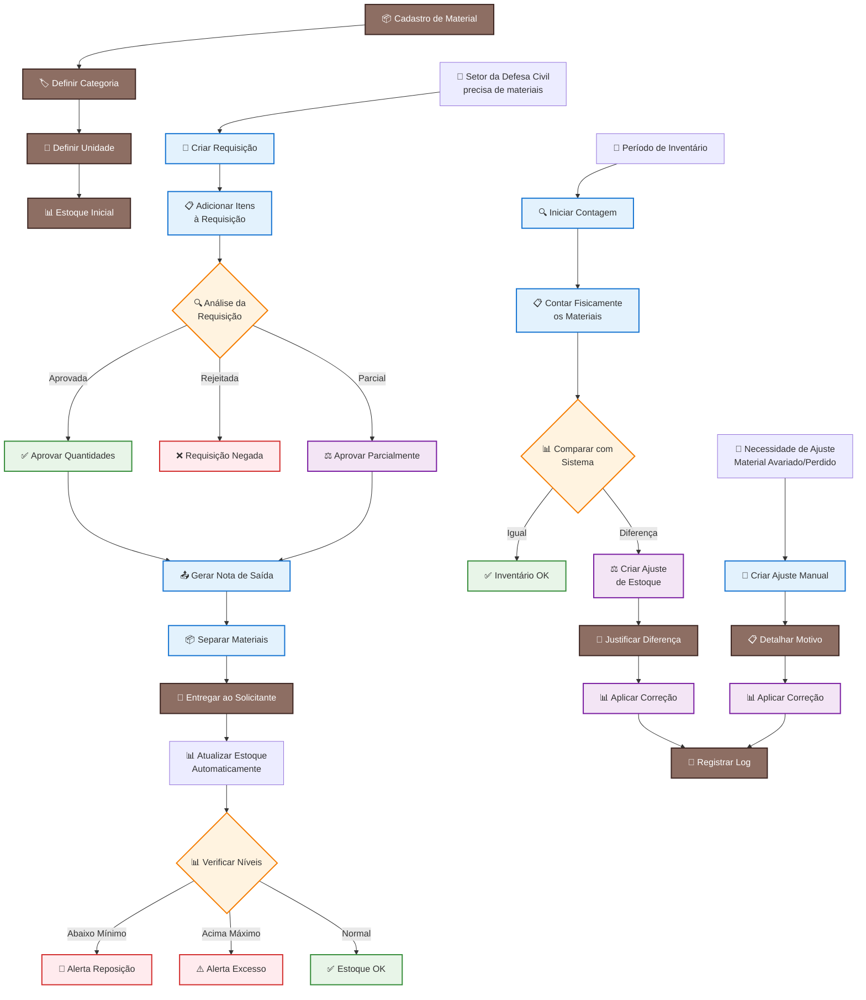

# Sistema de Controle de Estoque - Defesa Civil
## Documentação Técnica das Tabelas

---

## 📋 Visão Geral do Sistema

O sistema foi desenvolvido especificamente para atender às necessidades da **Defesa Civil**, que possui um **estoque central único** para armazenar diversos tipos de materiais utilizados em operações de emergência e prevenção.

### 🎯 Objetivo Principal
- Controlar a quantidade disponível de materiais
- Registrar saídas para operações
- Manter histórico de movimentações
- Realizar inventários periódicos

### 🏗️ Características do Sistema
- **Estoque único centralizado** (sem múltiplos almoxarifados)
- **Não há transferências** entre estoques
- **Foco em simplicidade** e eficiência operacional

---

## 🗂️ Estrutura das Tabelas

### 1. 📦 MATERIAL
**O que é:** Cadastro principal de todos os itens que podem ser estocados.

**Exemplos de materiais:**
- Canos e conexões hidráulicas
- Material elétrico (cabos, disjuntores)
- Equipamentos (lanchas, purificadores)
- EPIs (capacetes, coletes, luvas)

| Campo | Tipo | Descrição |
|-------|------|-----------|
| `id` | ID único | Identificador do material |
| `code` | Código | SKU ou código interno (ex: "CABO-001") |
| `name` | Texto | Nome do material (ex: "Cabo Elétrico 2.5mm") |
| `description` | Texto | Descrição detalhada |
| `category_id` | Referência | Categoria do material |
| `unit_id` | Referência | Unidade de medida |
| `min_stock` | Número | Quantidade mínima (alerta de reposição) |
| `max_stock` | Número | Quantidade máxima (alerta de excesso) |
| `is_active` | Sim/Não | Material ativo no sistema |

---

### 2. 🏷️ MATERIAL_CATEGORY
**O que é:** Organização hierárquica dos materiais por tipo.

**Exemplos de categorias:**
```
📁 Elétrico
  └── Cabos
  └── Disjuntores
📁 Hidráulico
  └── Canos
  └── Conexões
📁 EPIs
  └── Proteção Individual
📁 Equipamentos
  └── Embarcações
  └── Purificadores
```

| Campo | Tipo | Descrição |
|-------|------|-----------|
| `id` | ID único | Identificador da categoria |
| `name` | Texto | Nome da categoria |
| `parent_id` | Referência | Categoria pai (para subcategorias) |

---

### 3. 📏 UNIT
**O que é:** Unidades de medida para contabilizar os materiais.

**Exemplos:**
- UN (Unidade) - para itens individuais
- CX (Caixa) - para materiais embalados
- KG (Quilograma) - para materiais pesados
- L (Litro) - para líquidos
- M (Metro) - para cabos, canos

| Campo | Tipo | Descrição |
|-------|------|-----------|
| `id` | ID único | Identificador da unidade |
| `code` | Código | Abreviação (UN, KG, L) |
| `name` | Texto | Nome completo da unidade |

---

### 4. 📊 STOCK
**O que é:** Quantidade atual disponível de cada material no estoque.

> ⚠️ **Importante:** Esta tabela é atualizada automaticamente pelo sistema a cada movimentação!

| Campo | Tipo | Descrição |
|-------|------|-----------|
| `id` | ID único | Identificador do registro |
| `material_id` | Referência | Material controlado |
| `qty` | Número | Quantidade atual disponível |
| `updated_at` | Data/Hora | Última atualização |

**Exemplo:**
```
Material: Cabo Elétrico 2.5mm
Quantidade: 150 metros
Última atualização: 15/01/2024 14:30
```

---

## 🔄 Fluxo de Requisições e Saídas

### 5. 📝 REQUISITION
**O que é:** Solicitação de materiais feita por setores da Defesa Civil.

**Casos de uso:**
- Abrigo precisa de materiais para montagem
- Operação de emergência solicita equipamentos
- Manutenção preventiva de instalações

| Campo | Tipo | Descrição |
|-------|------|-----------|
| `id` | ID único | Identificador da requisição |
| `number` | Código | Número da requisição (ex: REQ-2024-001) |
| `department_id` | Referência | Setor solicitante |
| `requested_by_user_id` | Referência | Usuário que fez o pedido |
| `incident_id` | Referência | Ocorrência/operação relacionada |
| `status` | Status | OPEN, APPROVED, CLOSED |
| `requested_at` | Data/Hora | Data da solicitação |

---

### 6. 📋 REQ_ITEM
**O que é:** Itens detalhados de cada requisição.

| Campo | Tipo | Descrição |
|-------|------|-----------|
| `id` | ID único | Identificador do item |
| `requisition_id` | Referência | Requisição relacionada |
| `material_id` | Referência | Material solicitado |
| `qty_requested` | Número | Quantidade pedida |
| `qty_approved` | Número | Quantidade aprovada |

**Exemplo:**
```
Requisição REQ-2024-001:
- Cabo Elétrico 2.5mm: Pedido 50m → Aprovado 30m
- Disjuntor 20A: Pedido 10 un → Aprovado 10 un
```

---

### 7. 📤 ISSUE_NOTE
**O que é:** Documento oficial de saída de materiais do estoque.

> 💡 **Analogia:** Como uma "nota fiscal" interna que comprova a entrega dos materiais.

| Campo | Tipo | Descrição |
|-------|------|-----------|
| `id` | ID único | Identificador da saída |
| `number` | Código | Número do documento (ex: SAI-2024-001) |
| `requisition_id` | Referência | Requisição atendida |
| `issued_by_user_id` | Referência | Usuário que autorizou |
| `issued_at` | Data/Hora | Data da liberação |

---

### 8. 📦 ISSUE_ITEM
**O que é:** Itens efetivamente entregues em cada saída.

| Campo | Tipo | Descrição |
|-------|------|-----------|
| `id` | ID único | Identificador do item |
| `issue_note_id` | Referência | Saída relacionada |
| `material_id` | Referência | Material entregue |
| `qty` | Número | Quantidade liberada |

---

## 📊 Controle de Inventário

### 9. 🔍 INVENTORY_COUNT
**O que é:** Processo de contagem física dos materiais para conferência.

**Quando usar:**
- Inventários mensais/trimestrais
- Auditoria de estoque
- Conferência após grandes operações

| Campo | Tipo | Descrição |
|-------|------|-----------|
| `id` | ID único | Identificador do inventário |
| `status` | Status | OPEN, COUNTING, CLOSED |
| `started_at` | Data/Hora | Início da contagem |
| `closed_at` | Data/Hora | Fim da contagem |

---

### 10. 📋 INVENTORY_ITEM
**O que é:** Comparação entre quantidade no sistema vs. quantidade física encontrada.

| Campo | Tipo | Descrição |
|-------|------|-----------|
| `id` | ID único | Identificador do item |
| `inventory_count_id` | Referência | Inventário relacionado |
| `material_id` | Referência | Material contado |
| `system_qty` | Número | Quantidade no sistema |
| `counted_qty` | Número | Quantidade física encontrada |
| `diff_qty` | Número | Diferença (+ ou -) |

**Exemplo:**
```
Cabo Elétrico 2.5mm:
Sistema: 150m
Contado: 145m
Diferença: -5m (falta)
```

---

## ⚖️ Ajustes de Estoque

### 11. 🔧 STOCK_ADJUSTMENT
**O que é:** Correções manuais no estoque por diversos motivos.

**Motivos comuns:**
- ❌ Material avariado/vencido
- 🔍 Erro de registro anterior
- 💔 Perda/roubo
- 📦 Recebimento não registrado

| Campo | Tipo | Descrição |
|-------|------|-----------|
| `id` | ID único | Identificador do ajuste |
| `reason` | Texto | Motivo da correção |
| `adjusted_by_user_id` | Referência | Usuário responsável |
| `adjusted_at` | Data/Hora | Data do ajuste |
| `notes` | Texto | Observações adicionais |

---

### 12. 📝 STOCK_ADJUSTMENT_ITEM
**O que é:** Detalhes dos materiais ajustados.

| Campo | Tipo | Descrição |
|-------|------|-----------|
| `id` | ID único | Identificador do item |
| `stock_adjustment_id` | Referência | Ajuste relacionado |
| `material_id` | Referência | Material ajustado |
| `qty_delta` | Número | Quantidade alterada (+/-) |

**Exemplo:**
```
Ajuste por material avariado:
- Cabo Elétrico 2.5mm: -5m (redução)
- Motivo: "Cabo danificado por umidade"
```

---

## 🔄 Fluxo Operacional Completo

### 📊 **Fluxograma do Sistema**



### 📋 **Processos Principais Detalhados**

### 1️⃣ **Cadastro Inicial**
```
📦 Material → 🏷️ Categoria → 📏 Unidade → 📊 Estoque Inicial
```

### 2️⃣ **Solicitação de Material**
```
📝 Requisição → 📋 Itens → 🔍 Análise → ✅ Aprovação
```

### 3️⃣ **Saída de Material**
```
📤 Nota de Saída → 📦 Separação → 🚚 Entrega → 📊 Atualização
```

### 4️⃣ **Controle Periódico**
```
📅 Inventário → 📋 Contagem → 📊 Comparação → ⚖️ Ajustes
```

### 📋 **Fluxograma em Texto (Markdown)**

```
🏗️ CADASTRO INICIAL
├── 📦 Cadastro de Material
├── 🏷️ Definir Categoria  
├── 📏 Definir Unidade
└── 📊 Estoque Inicial

🔄 FLUXO DE REQUISIÇÃO
├── 🏢 Setor da Defesa Civil precisa de materiais
├── 📝 Criar Requisição
├── 📋 Adicionar Itens à Requisição
├── 🔍 Análise da Requisição
│   ├── ✅ Aprovada → Aprovar Quantidades
│   ├── ❌ Rejeitada → Requisição Negada
│   └── ⚖️ Parcial → Aprovar Parcialmente
└── ➡️ Seguir para Saída de Material

📤 SAÍDA DE MATERIAL
├── 📄 Gerar Nota de Saída
├── 📦 Separar Materiais
├── 🚚 Entregar ao Solicitante
├── 📊 Atualizar Estoque (Automático)
└── 🔍 Verificar Níveis
    ├── 🚨 Abaixo Mínimo → Alerta Reposição
    ├── ⚠️ Acima Máximo → Alerta Excesso
    └── ✅ Normal → Estoque OK

📋 CONTROLE DE INVENTÁRIO
├── 📅 Período de Inventário
├── 🔍 Iniciar Contagem
├── 📊 Contar Fisicamente os Materiais
├── 📈 Comparar com Sistema
│   ├── ✅ Igual → Inventário OK
│   └── ⚖️ Diferença → Criar Ajuste de Estoque
│       ├── 📝 Justificar Diferença
│       └── 📊 Aplicar Correção
└── 📋 Finalizar Inventário

🔧 AJUSTES MANUAIS
├── 🛠️ Necessidade de Ajuste (Material Avariado/Perdido)
├── 📝 Criar Ajuste Manual
├── 📋 Detalhar Motivo
├── 📊 Aplicar Correção
└── 📝 Registrar Log de Auditoria
```

### 🎨 **Legenda do Fluxograma**

| Símbolo | Tipo | Descrição |
|---------|------|-----------|
| 📦 📝 📋 | **Processos** | Ações executadas pelo usuário |
| 🔍 ⚖️ 📈 | **Decisões** | Pontos de análise/aprovação |
| 🚨 ⚠️ | **Alertas** | Situações que requerem atenção |
| ✅ 📊 | **Sucesso** | Operações concluídas com êxito |
| ├── └── ➡️ | **Fluxo** | Direção do processo |

### ⚡ **Fluxograma Simplificado (Visão Macro)**

```
INÍCIO
  ↓
📦 CADASTRAR MATERIAIS
  ↓
📊 DEFINIR ESTOQUE INICIAL
  ↓
🔄 ┌─────────────────────────────────────┐
   │                                     │
   │  📝 REQUISIÇÃO DE MATERIAL          │
   │    ↓                                │
   │  🔍 ANÁLISE E APROVAÇÃO             │
   │    ↓                                │
   │  📤 SAÍDA DE MATERIAL               │
   │    ↓                                │
   │  📊 ATUALIZAÇÃO AUTOMÁTICA          │
   │    ↓                                │
   │  🚨 VERIFICAÇÃO DE ALERTAS          │
   │                                     │
   └─────────────────────────────────────┘
  ↓
📋 INVENTÁRIOS PERIÓDICOS
  ↓
⚖️ AJUSTES (SE NECESSÁRIO)
  ↓
📝 LOG DE AUDITORIA
  ↓
FIM
```

### 🔄 **Cenários Operacionais**

#### **Cenário 1: Operação de Emergência** 🚨
```
Enchente detectada → Requisição de materiais → Aprovação urgente → 
Saída imediata → Atualização do estoque
```

#### **Cenário 2: Manutenção Preventiva** 🔧
```
Planejamento mensal → Requisição programada → Análise técnica → 
Aprovação parcial → Entrega escalonada
```

#### **Cenário 3: Inventário de Rotina** 📋
```
Cronograma trimestral → Contagem por categoria → 
Identificação de diferenças → Ajustes justificados
```

#### **Cenário 4: Material Avariado** ⚠️
```
Detecção de avaria → Registro da ocorrência → 
Ajuste manual → Baixa do estoque → Log de auditoria
```

---


## 🎯 Benefícios do Sistema

✅ **Simplicidade:** Foco no essencial, sem complexidade desnecessária  
✅ **Rastreabilidade:** Histórico completo de todas as movimentações  
✅ **Controle:** Alertas de estoque mínimo/máximo  
✅ **Auditoria:** Logs detalhados de ajustes e inventários  
✅ **Eficiência:** Processo otimizado para operações da Defesa Civil  

---

## 🚀 Próximos Passos

Para implementar este sistema, recomenda-se:

1. **Fase 1:** Cadastro de materiais e categorias
2. **Fase 2:** Implementação do fluxo de requisições
3. **Fase 3:** Sistema de inventários
4. **Fase 4:** Relatórios e dashboards
5. **Fase 5:** Integrações e melhorias

---

*Este documento serve como base técnica para desenvolvimento e treinamento de usuários do sistema de controle de estoque da Defesa Civil.*

